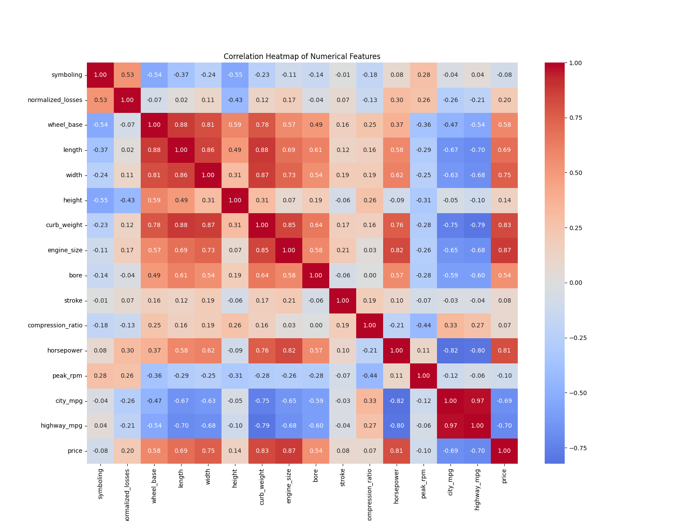
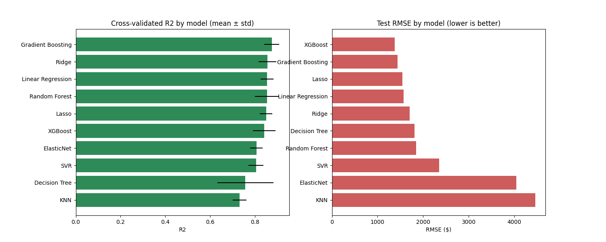

# 🚗 PRCP-1017: Automobile Price Prediction

Predicting car prices from technical specifications to help automotive companies understand pricing dynamics in new markets.


---

## 📋 Table of Contents
- [Problem Statement](#-problem-statement)
- [Dataset](#-dataset)
- [Project Workflow](#-project-workflow)
- [Results](#-results)
- [Screenshots](#-screenshots)
- [Installation](#-installation)
- [Usage](#-usage)
- [Project Structure](#-project-structure)
- [Future Work](#-future-work)
- [Author](#-author)

---

## 🎯 Problem Statement

An automotive company is entering a new market and needs to understand how car prices relate to technical specifications (engine size, horsepower, fuel efficiency, body style, brand, etc.). This project builds a regression model to:

1. Perform a complete data analysis on the automobile dataset
2. Predict car price from 25 independent variables
3. Help management understand which features drive price, so they can adjust car design and business strategy to hit target price points

**Problem Type:** Supervised Regression

---

## 📊 Dataset

- **Source:** UCI Machine Learning Repository (Automobile Dataset)
- **Rows:** 205 cars
- **Columns:** 26 (25 features + `price` target)
- **Features:** Mix of categorical (make, fuel-type, body-style, etc.) and continuous (engine-size, horsepower, curb-weight, etc.)
- **Target:** `price` (continuous, $5,118–$45,400)

Full attribute descriptions are in [`data/raw/attribute_info.md`](data/raw/attribute_info.md).

---

## 🔄 Project Workflow

```
Data Loading → EDA → Preprocessing → Feature Engineering → 
Train-Test Split → Model Training (13 algorithms) → 
Cross-Validation → Hyperparameter Tuning → Evaluation
```

**Key techniques used:**
- Missing value imputation (median/mode), based on `"?"` markers in raw data
- One-Hot / Label / Ordinal encoding tailored per categorical column type
- Log-transformation of `price` to correct right-skew
- Multicollinearity handling via correlation filtering + Random Forest importance
- Repeated 5-Fold Cross-Validation (given small 205-row dataset)
- Hyperparameter tuning via GridSearchCV, RandomizedSearchCV, and Optuna
- Model interpretation via SHAP (global + local explanations)

---

## 🏆 Results

Ten regression models were trained and evaluated on the held-out test set, using 5-Fold Cross-Validation on the training set for a robust performance estimate.
 
| Model | Train R² | Test R² | CV R² (Mean) | CV R² (Std) | Test MAE ($) | Test RMSE ($) |
|---|---|---|---|---|---|---|
| **XGBoost** | 0.9986 | **0.9760** | 0.8404 | 0.0506 | **891.70** | **1377.59** |
| Gradient Boosting | 0.9978 | 0.9740 | **0.8739** | 0.0326 | 991.26 | 1434.32 |
| Lasso | 0.9647 | 0.9698 | 0.8495 | 0.0279 | 1142.83 | 1545.21 |
| Linear Regression | 0.9649 | 0.9688 | 0.8527 | 0.0287 | 1163.47 | 1570.03 |
| Ridge | 0.9536 | 0.9632 | 0.8553 | 0.0399 | 1390.26 | 1706.24 |
| Decision Tree | 0.9597 | 0.9584 | 0.7566 | 0.1259 | 1203.83 | 1813.67 |
| Random Forest | 0.9822 | 0.9570 | 0.8527 | 0.0541 | 1270.78 | 1843.91 |
| SVR | 0.9697 | 0.9301 | 0.8037 | 0.0333 | 1709.29 | 2349.82 |
| ElasticNet | 0.8455 | 0.7930 | 0.8058 | 0.0278 | 2960.00 | 4044.95 |
| KNN | 0.8496 | 0.7485 | 0.7303 | 0.0307 | 2848.09 | 4458.00 |
 
### Best Model: XGBoost 🏆
 
**XGBoost** was selected as the final production model based on its overall test-set performance:
 
- **Test R²:** 0.9760 — explains ~97.6% of the variance in car prices on unseen data
- **Test MAE:** $891.70 — average prediction is off by less than $900
- **Test RMSE:** $1,377.59
- **Train R²:** 0.9986
**Note on model selection:** Gradient Boosting recorded the highest mean cross-validation R² (0.8739 vs. XGBoost's 0.8404), meaning it was slightly more consistent across different training folds. However, XGBoost outperformed it on every held-out test metric (R², MAE, and RMSE), which carries more weight for final model selection since the test set is the closest proxy we have to real-world, unseen data. XGBoost was therefore chosen as the model recommended for production.

[📊 Download Model Results](./models/model_results.csv)
---

## 🖼️ Screenshots

| EDA: Correlation Heatmap | Model Comparison |
|---|---|---|
|  |  |

---

## ⚙️ Installation

```bash
# Clone the repository
git clone https://github.com/yashwant2002/Automobile_price_prediction_ML.git
cd PRCP-1017-AutoPricePred

# Create a virtual environment
python -m venv venv
source venv/bin/activate      # Windows: venv\Scripts\activate

# Install dependencies
pip install -r requirements.txt
```

---

## 🚀 Usage

**Run the notebook:**
```bash
jupyter notebook notebook/PRCP-1017-AutoPricePred.ipynb
```

**Use the saved model directly in Python:**
```python
import pickle

with open("../models/best_model.pkl", "rb") as f:
    pickle.load(best_pipe, f)
# See notebook Section 16 for full inference pipeline
```

---

## 📁 Project Structure

```
PRCP-1017-AutoPricePred/
├── data/               # raw and processed datasets
├── notebook/           # main Jupyter notebook (full analysis + modeling)
├── src/                # reusable preprocessing/training scripts
├── models/             # saved trained model + pipeline artifacts
├── reports/            # EDA, model comparison, and challenges reports
├── images/             # all saved plots
├── app/                # Streamlit deployment app
├── requirements.txt
└── README.md
```

---

## 🔮 Future Work

- Collect more data on luxury/rare-brand cars to reduce prediction error in that segment
- Explore prediction intervals (quantile regression) for uncertainty estimates
- Add Individual Conditional Expectation (ICE) plots for subgroup-level interpretation
- Deploy via Docker + CI/CD pipeline for full production readiness
- Experiment with stacking/ensembling top 3 models

---

## 👤 Author

*Yashwant Sahu*
*yashsahu3333@gmail.com*

Project completed as part of a Data Science Capstone (PRCP-1017).